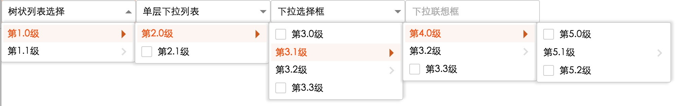
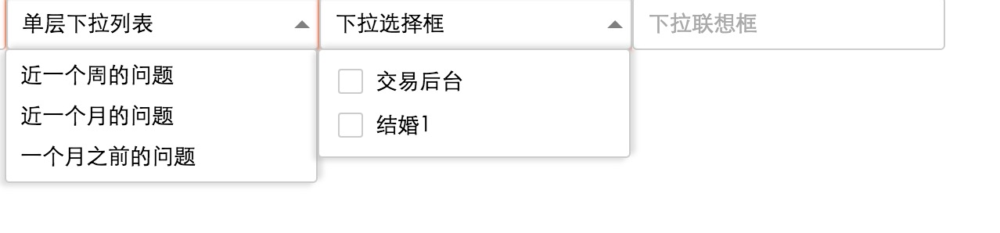

# eg-dropdown

使用react构建pc端应用的下拉菜单解决方案，配合eagle-ui将使界面和功能更完善

## 使用

``` javascript
 let mockMultiDropData=[
            {
                "typeName": "第1.0级",
                "children": [
                    {
                        "typeName": "第2.0级",
                        "children": [
                            {
                            "typeName": "第3.0级",
                            "children": [ ],
                            "leaf":true
                            },
                            {
                                "typeName":"第3.1级",
                                "children": [{
                                    "typeName":"第4.0级",
                                    "children": [
                                        {
                                            "typeName":"第5.0级",
                                            "children": [ ],
                                            "leaf":true
                                        },
                                        {
                                            "typeName": "第5.1级",
                                            "children": [ ]
                                        },
                                        {
                                            "typeName": "第5.2级",
                                            "children": [ ],
                                            "leaf":true
                                        }]
                                    },
                                    {
                                        "typeName": "第3.2级",
                                        "children": [ ]
                                    },
                                    {
                                        "typeName": "第3.3级",
                                        "children": [ ],
                                        "leaf":true
                                    }]
                            },
                            {
                                "typeName": "第3.2级",
                                "children": [ ]
                            },
                            {
                                "typeName": "第3.3级",
                                "children": [ ],
                                "leaf":true
                            }
                        ]
                    },
                    {
                        "typeName": "第2.1级",
                        "children": [ ],
                        "leaf":true
                    }
                ]
            },
            {
                "typeName": "第1.1级",
                "children": [
                    {
                        "typeName":"第2.0级",
                        "children": [
                            {
                                "typeName": "3.0级",
                                "children": [ ],
                                "leaf":true
                            }
                        ]
                    }
                ]
            }
        ];
	import {DropDownMenu, MultiDropDownMenu, DropDownSelect,DropDownSuggestion} from "eg-dropdown";
    	class ModuleName extends Component {
    	render(){
    	    	<MultiDropDownMenu  dropDownData={mockMultiDropData} title="树状列表选择" ref="MultiDropDownMenu"/>
    	}
    	}
```
## UI展示
>树状下拉选项图


>普通下拉单选和展示


## 使用指南
> 请参考example/src/index.js文件

## 下载

```	bash
    #使用
    npm install eg-dropdown
	#例子演示	
	npm run demo	
```


